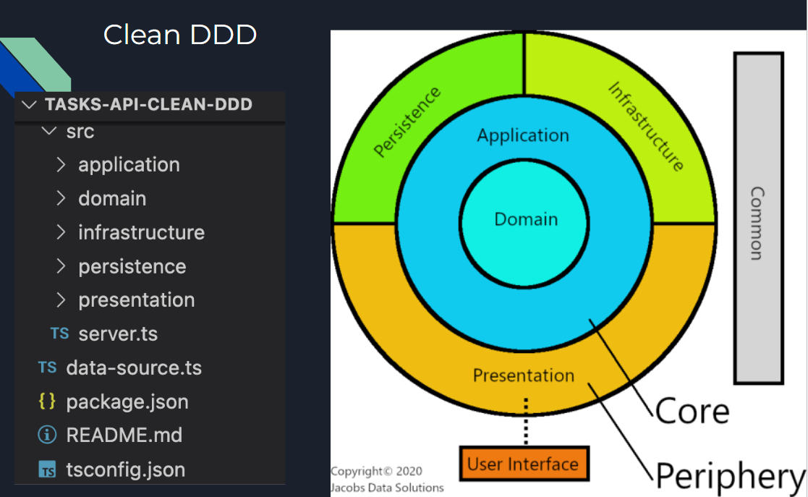

# Como esse projeto foi criado?

# Arquitetura

# Setup Project


* cd tasks-api-orm
* yarn init -y
* yarn add express
* yarn add @types/express -D
* yarn add reflect-metadata
* yarn add @types/node -D
* yarn add typescript -D
* yarn tsc --init
* yarn add ts-node -D
* yarn add nodemon -D
* code .
* Adicionar no package json  
```"scripts": {
    "start": "nodemon --ignore node_modules src/server.ts"
  },
  ```

# Cria server.ts 

```typescript
import express from "express";
import { Request, Response } from "express";
import "reflect-metadata";
const app = express();

app.get("/", (req: Request, res: Response) => res.json({ ok: "ok!" }));

app.listen(3333, () => {
    console.log("Server UP --> http://localhost:3333");
  });

```


#Typeorm

yarn add typeorm

// tsconfig.json
"experimentalDecorators": true,
"emitDecoratorMetadata": true,

// server.ts
import 'reflect-metadata'

# tasks-type-orm-express
